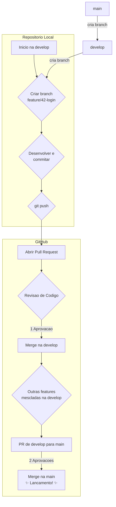

# 🚀 Guia Completo de Contribuicao com Git & GitHub

> ✨ Este documento concentra o fluxo de desenvolvimento. Seguir cada etapa garante organizacao, qualidade e rastreabilidade em todo o ciclo de vida do codigo.

## 📚 Indice
- [🧭 Filosofia e Fluxo de Trabalho (Git Flow)](#-filosofia-e-fluxo-de-trabalho-git-flow)
  - [🗺 Diagrama do Fluxo](#-diagrama-do-fluxo)
  - [🌿 Branches Principais](#-branches-principais)
- [🧩 Ciclo de Vida de uma Tarefa](#-ciclo-de-vida-de-uma-tarefa)
  - [✅ Passo 1: Issue](#-passo-1-issue)
  - [🛠 Passo 2: Branch](#-passo-2-branch)
  - [💾 Passo 3: Commit](#-passo-3-commit)
  - [☁ Passo 4: Push](#-passo-4-push)
  - [📬 Passo 5: Pull Request](#-passo-5-pull-request)
- [🔍 Revisao de Codigo (Code Review)](#-revisao-de-codigo-code-review)
  - [🧭 Como Revisar](#-como-revisar)
  - [✅ Como Aprovar](#-como-aprovar)
  - [🔄 Ajustes e Feedback](#-ajustes-e-feedback)
- [🔒 Regras de Merge e Aprovacoes](#-regras-de-merge-e-aprovacoes)
- [🧠 Topicos Importantes](#-topicos-importantes)
  - [⚔ Resolvendo Conflitos](#-resolvendo-conflitos)
  - [🔄 Mantendo a Branch Atualizada](#-mantendo-a-branch-atualizada)
- [🛠 Apendice: Comandos Uteis do Git](#-apendice-comandos-uteis-do-git)

---

## 🧭 Filosofia e Fluxo de Trabalho (Git Flow)
Adotamos um Git Flow simplificado: separar trabalho em andamento do codigo estavel. A `main` permanece sagrada, enquanto `develop` agrega funcionalidades aprovadas para o proximo release.

### 🗺 Diagrama do Fluxo


### 🌿 Branches Principais
- **`main`**: codigo em producao, estavel e testado. 🔒 Sem push direto.
- **`develop`**: integra funcionalidades finalizadas que seguirao para o proximo deploy.

---

## 🧩 Ciclo de Vida de uma Tarefa
Cada demanda comeca como uma issue, ganha uma branch dedicada, passa por commits, push e culmina em um Pull Request revisado.

### ✅ Passo 1: Issue
Toda tarefa nasce em **Issues** (GitHub > Issues > New issue).

**Template sugerido:**
```
**Descricao do problema/funcionalidade:**
(Explique o escopo com clareza.)

**Passos para reproduzir (bugs):**
1. Acesse a pagina '...'
2. Clique em '...'
3. Observe o erro.

**Comportamento esperado:**
(Defina o resultado ideal.)

**Criterios de aceitacao:**
- [ ] Exemplo de requisito 1
- [ ] Exemplo de requisito 2
```
- Atribua-se como _assignee_ ✅
- Marque _labels_ (ex.: `bug`, `feature`, `docs`).

> 💡 Exemplo: Issue #42 � "Adicionar validacao de e-mail no cadastro".

### 🛠 Passo 2: Branch
Crie a branch a partir da `develop` atualizada.

**Convenio**: `tipo/numero-da-issue-descricao-curta`
- `feature/42-validacao-email-cadastro`
- `fix/51-layout-mobile-header`

```bash
# 1. Ir para develop
git checkout develop

# 2. Garantir codigo atualizado
git pull origin develop

# 3. Criar e entrar na branch da tarefa
git checkout -b feature/42-validacao-email-cadastro
```

### 💾 Passo 3: Commit
Commits pequenos, logicos e no padrao **Conventional Commits**.

**Formato:** `tipo(escopo): descricao`
- `feat`: nova funcionalidade
- `fix`: correcao de bug
- `docs`: documentacao
- `style`: formatacao (sem alterar logica)
- `refactor`: refatoracao
- `test`: testes

```bash
# Funcao de validacao criada
git add .
git commit -m "feat(cadastro): adiciona validacao de e-mail"

# Integra na UI
git add .
git commit -m "feat(cadastro): usa validacao no formulario"

# Mensagem de erro exibida
git add .
git commit -m "fix(cadastro): mostra alerta para e-mail invalido"
```

### ☁ Passo 4: Push
```bash
# Primeira vez na branch
git push --set-upstream origin feature/42-validacao-email-cadastro

# Envios seguintes
git push
```

### 📬 Passo 5: Pull Request
O PR centraliza colaboracao e revisoes.
1. Clique em **Compare & pull request** apos o push.
2. Configure **base** = `develop`, **compare** = sua branch.
3. Descreva utilizando o template recomendado:

```
## Descricao
Explique o que mudou.

## Mudancas Realizadas
- Item 1
- Item 2

## Como Testar
1. Passo detalhado

## Link da Issue
Resolve #numero
```
- Adicione reviewers 👥
- Use **Draft PR** se ainda for um trabalho em progresso.

---

## 🔍 Revisao de Codigo (Code Review)

### 🧭 Como Revisar
1. Acesse **Pull requests** > PR desejado.
2. Analise em **Files changed**.
3. Seja construtivo: sugerir ajustes, questionar cenarios, validar testes.
   - Utilize **Suggest change** para propor codigo direto.

### ✅ Como Aprovar
1. Clique em **Review changes** (canto superior-direito).
2. Escolha:
   - ✅ **Approve** � pronto para merge.
   - 💡 **Request changes** � bloqueia ate corrigir.
   - ✨ **Comment** � feedback sem bloquear.
3. Envie em **Submit review**.

### 🔄 Ajustes e Feedback
- Recebeu comentarios? Sem dramas! 😀
- Ajuste na branch local, crie novos commits (ex.: `fix(cadastro): ajusta regex`).
- `git push` atualiza o PR automaticamente.
- Marque conversas como **Resolve conversation** quando concluir.

---

## 🔒 Regras de Merge e Aprovacoes
- PR para `develop`: minimo **1 aprovacao**.
- PR para `main`: minimo **2 aprovacoes** (sempre `develop` -> `main`).
- Estrategia oficial: **Squash and merge** para manter historico limpo.

---

## 🧠 Topicos Importantes

### ⚔ Resolvendo Conflitos
```bash
# Na sua branch
git pull origin develop
```
- O Git indicara arquivos conflitados.
- Resolva os marcadores `<<<<<<<`, `=======`, `>>>>>>>` manualmente.
- Conclua:
```bash
git add .
git commit -m "chore: resolve conflitos com develop"
git push
```

### 🔄 Mantendo a Branch Atualizada
Para longas jornadas de desenvolvimento, atualize com rebase:
```bash
git pull --rebase origin develop
```
- O `--rebase` reaplica seus commits no topo da `develop`, mantendo historico linear.

---

## 🛠 Apendice: Comandos Uteis do Git
```bash
# Log simplificado e visual
git log --oneline --graph --decorate

# Guardar alteracoes sem commit
git stash

# Recuperar o ultimo stash
git stash pop

# Descartar alteracoes locais de um arquivo
git checkout -- nome-do-arquivo.js

# Renomear a branch atual
git branch -m novo-nome-da-branch
```

---

🎉 Siga este guia sempre que iniciar uma tarefa: cada etapa fortalece colaboracao, qualidade e previsibilidade nas entregas!